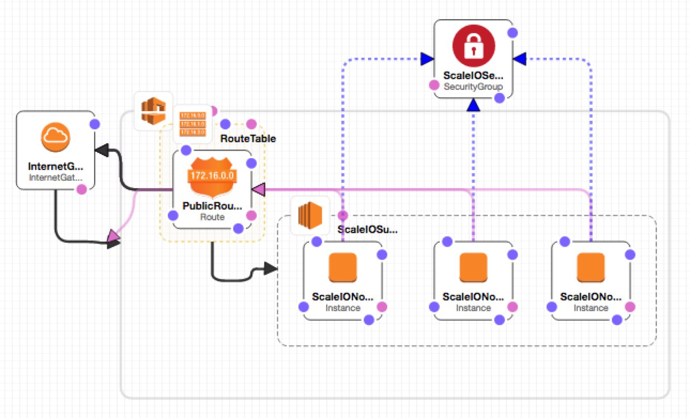

# aws-scaleio


A project to stand up a ScaleIO cluster in AWS, for testing against EMC {code} projects. This project is intended to be a component in a continuous-integration pipeline, so we can ~~stop testing against the ScaleIO cluster in Kenny's garage~~ automate testing in a more distributable fashion.

This template uses a custom AMI image that is (currently) only available in the US-West-1 (aka N.California) region. You've been warned!

##Usage

Launch this template **currently in the US-West-1 (_aka N.California_) region only** using AWS Cloudformation. 

The password for the ScaleIO admin is 'F00barbaz'. Other places a password might be used, same thing.

###AWS Web GUI
Using the AWS web gui, in the services selection window:
 - click 'Cloudformation' under 'Management Tools'
 - click 'Create Stack', then 'Choose a Template'
 - click 'Upload file to S3', and upload the .json file from this repo
 - give the stack a name (like ScaleIOTesting or something)
 - select a keypair that exists in the N.California region!
 - alter the ssh source CIDR if you like, or don't
 - click next, add tags if you want, or don't, then click next
 - review your settings and click 'Create' to create the stack

The stack will take approximately two minutes to build, and then the nodes should be available for ssh login.

###AWS Commandline
To launch this stack using AWS commandline tools, use a commandline similar to the following:

```
[user@host] ~/ $ aws cloudformation create-stack --stack-name ScaleIOTesting \
--template-body file:////home/ME/dev/aws-scaleio/ScaleIO_Testing_Cluster.json \
--parameters ParameterKey=KeyName,ParameterValue=MYKEY
```

The stack will take approximately two minutes to build, and then should be available for login.

##Once It's Running
This template uses Red Hat Enterprise Linux (RHEL) as the base operating system, so to log in with ssh *use the username "ec2-user"*.
 
The script launches three AWS instances of type 't1.medium', with the internal IP addresses 10.0.0.11, 10.0.0.12 and 10.0.0.13. The ScaleIO installer was deployed on 10.0.0.11 and then used to install **ScaleIO v2.0.0-5014** onto the three nodes.

Each of the nodes has a 120Gb SSD drive attached - this drive appears as **/dev/xdvc**.

When the machines come up, there appears to be a bit of a race condition between 10.0.0.11 and 10.0.0.12 as to whom will become the MDM master, whatever that is. SSHing to on or more of the machines until you find the master, then issuing the following command:

```scli --login --username admin --password F00barbaz```

should log you into the ScaleIO MDM, then you should be able to manipulate the storage volumes.

##Using ScaleIO for n00bs

ScaleIO is awfully cool, but can be a little confusing if you haven't used it before. Here's some tips.

###Vocabulary
*MDM* - Metadata Manager. Manages and configures the cluster. In this setup it can be either 10.0.0.11 or 10.0.0.12, depending on who won the race on startup. ¯\\_(ツ)_/¯

*SDS* - ScaleIO Data Server. Where data is stored. In this cluster, all three servers are configured as SDS's.

*SDC* - ScaleIO Data Client. Where volumes can be mounted - typically any server you'd want a volume to be mounted on, and in this cluster all three servers are configured as SDC's.

###Commands

Log into the MDM as the admin user (note that the MDM IP might be 10.0.0.12):
```scli --login --username admin --password F00barbaz --mdm_ip 10.0.0.11```

Create a new 20-gig volume named "testvol"::
```scli --add_volume --volume_name testvol --size_gb 20 --storage_pool_name default --protection_domain_name default --mdm_ip 10.0.0.11```

Map that volume to the server at 10.0.0.12, so it can be mounted:
```scli --map_volume_to_sdc --sdc_ip 10.0.0.12 --mdm_ip 10.0.0.11 --volume_name testvol```

Mounting that volume on 10.0.0.12 (executed as root on 10.0.0.12):
```mkfs.ext4 /dev/scinia && mount /dev/scinia /mnt/whatever```

Unmapping the volume (should be unmounted first to avoid errors):
```scli --unmap_volume_from_sdc --sdc_ip 10.0.0.12 --mdm_ip 10.0.0.11 --volume_name testvol```

Get a list of all volumes in the cluster:
```scli --query_all_volumes```


##Using REX-Ray
- Install the latest version of REX-Ray from [the REX-Ray Github repository](https://github.com/emccode/rexray)
```
curl -sSL https://dl.bintray.com/emccode/rexray/install | sh -s stable
```
- Create `/etc/rexray/config.yml` and add the following entries to that file:
```YAML
rexray:
  storageDrivers:
  - scaleio
scaleio:
  endpoint: https://10.0.0.11/api
  insecure: true
  userName: admin
  password: F00barbaz
  systemId: 39f2e3fe27fbc1dc
  protectionDomainName: default
  storagePoolName: default
```
- test with `rexray volume list` (success should return nothing at all)
- read the docs at (http://rexray.readthedocs.io/en/stable/) for more information.

